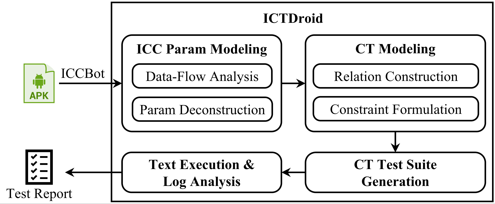

# ICTDroid

Parameter-Aware Combinatorial Testing for Components of Android Apps

## Overview

This is a tool to perform paremeter-aware combinatorial testing for components of Android applications.

## Video Deomostration

The following video demostration is available at: [https://youtu.be/KgqLQwIAQi0](https://youtu.be/KgqLQwIAQi0).

<!-- markdownlint-disable-next-line MD013 -->
<iframe width="560" height="315" src="https://www.youtube.com/embed/KgqLQwIAQi0" title="YouTube video player" frameborder="0" allow="accelerometer; autoplay; clipboard-write; encrypted-media; gyroscope; picture-in-picture; web-share" allowfullscreen></iframe>
